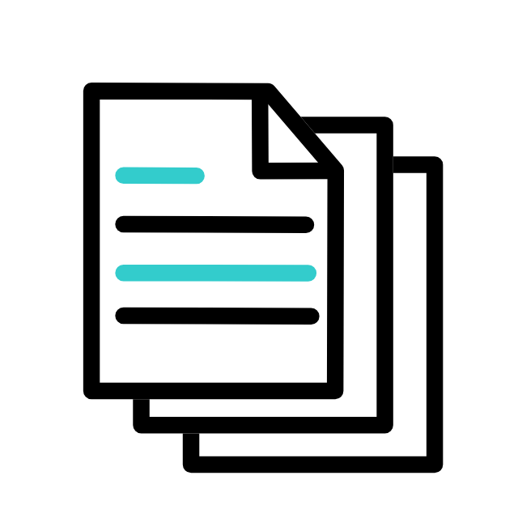
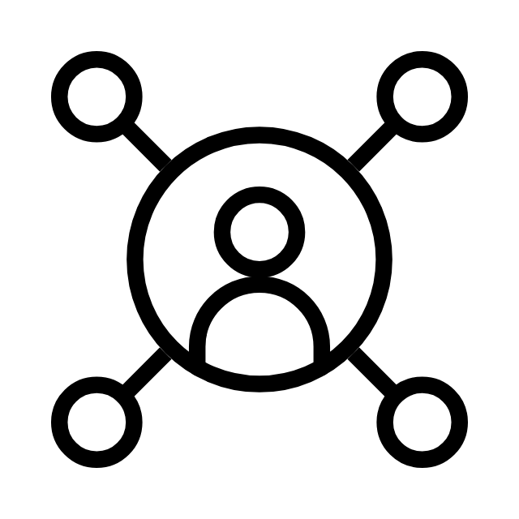
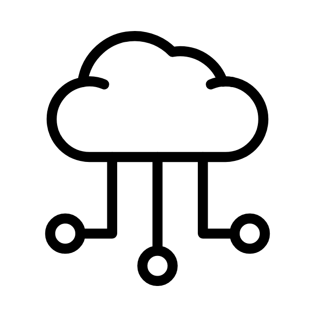
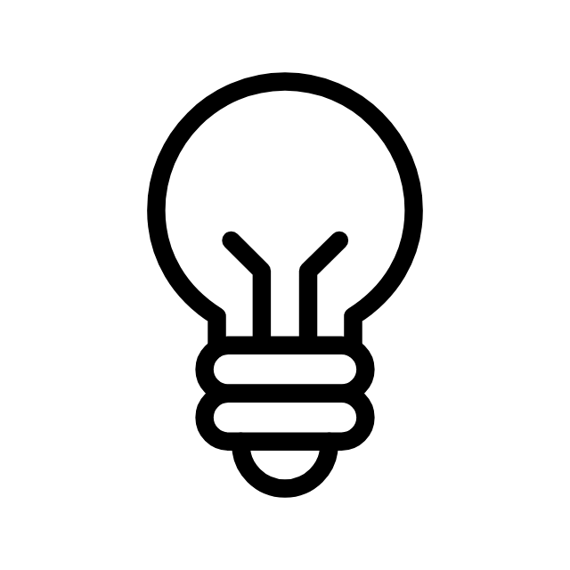

### <b> Newsletters and Articles</b>

- [Software Entrepreneurship](https://www.linkedin.com/newsletters/%D8%B1%D9%8A%D8%A7%D8%AF%D8%A9-%D8%A7%D9%84%D8%A3%D8%B9%D9%85%D8%A7%D9%84-%D9%81%D9%8A-%D8%A7%D9%84%D8%A8%D8%B1%D9%85%D8%AC%D9%8A%D8%A7%D8%AA-7120424670171918338/)
-- نشرة ريادة الأعمال في البرمجيات
- [Project Idea](https://www.linkedin.com/newsletters/%25D9%2581%25D9%2583%25D8%25B1%25D8%25A9-%25D9%2585%25D8%25B4%25D8%25B1%25D9%2588%25D8%25B9-7195055915396452352/)
-- فكرة مشروع، نشرة أسبوعية لمشاريع عالمية لتنفيذها محلياً
- [Other Articles](https://www.linkedin.com/in/mohammed-assiri/recent-activity/articles/)
-- مقالات أخرى

---

### <b> How to reach me</b>

    
    

---

### <b> Github Stats</b> 

---

###  Currently working on

- [assirims/test_gems](https://github.com/assirims/test_gems) - 
- [assirims/simple_course_evalution](https://github.com/assirims/simple_course_evalution) - ## Lectures Evaluation Platform  A Ruby on Rails app where students register and submit lecture feedback to enhance educational quality.
- [SaudiOpenSourceCommunity/SaudiOSS](https://github.com/SaudiOpenSourceCommunity/SaudiOSS) - قائمة بالمشاريع السعودية المفتوحة المصدر
- [assirims/nobundle](https://github.com/assirims/nobundle) - 
###  Latest projects

- [assirims/simple_course_evalution](https://github.com/assirims/simple_course_evalution) - ## Lectures Evaluation Platform  A Ruby on Rails app where students register and submit lecture feedback to enhance educational quality.
- [assirims/nobundle](https://github.com/assirims/nobundle) - 
- [assirims/fvb_site](https://github.com/assirims/fvb_site) - توثيق لمنصة تقييم المحاضرات
- [assirims/blog_app](https://github.com/assirims/blog_app) - 
- [assirims/workshop_ror](https://github.com/assirims/workshop_ror) - 

---

  
