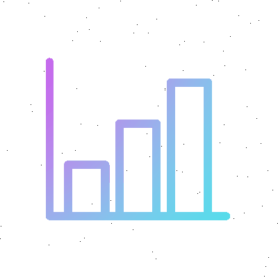

<h1 align="center"><b>Hi , I'm Mohammed Assiri - @assirims </b></h1>

## <picture></picture> >> About me

<picture> </picture>

 

Experienced University Assistant Professor with a demonstrated history of working in the higher education industry. interested in Software Engineering, Technology Innovation, Verification and Validation, and Software Entrepreneurship. Strong education professional with a Doctor of Philosophy in Software Engineering from McMaster University where I utilized formal methods to model, verify, and validate the interdisciplinary requirements of cardiac pacemaker systems.

  

## <b> >> Selected Skills</b>
 

<ul>
<li>Languages:</li>
<ul>
    <li></li>
    <li></li>
</ul>

<li>Front-End Development:</li>
<ul>
    <li></li>
    <li></li>
    <li></li>
</ul>

<li>Softwares and Tools:</li>
<ul>
    <li></li>
    <li></li>
    <li></li>
    <li></li>
</ul>

<li>Extras:</li>
<ul>
    <li></li>
    <li></li>
</ul>

</ul>

 
 

## <b> >> Github Stats</b>

 

 

 
 
    

 
 

 
 

 
 

 
 

## <b> >> Let's Connect..!</b>

<ul>

<li>

</li>

 

<li>

</li>

 

</ul>

